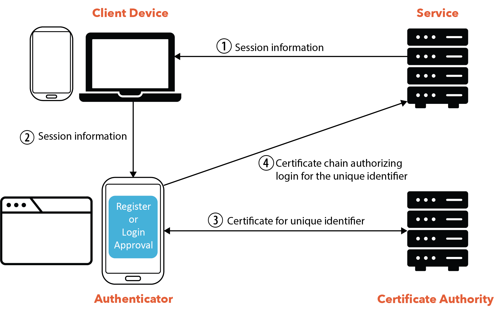

# Version 0.2

This document describes Version 0.2 of the Let's Authenticate System.

## Terminology

- authenticator: a device used to store certificates and authorize logins; we
  currently support three authenticators: a smartphone app, a browser extension,
  and a desktop app

- certificate authority: a system that issues certificates to an authenticator,
  certifying that the authenticator owns an opaque identifier formatted as
  `id@ca.org`.

- client device: a device where a user accesses a service, such as a laptop,
  desktop, or smartphone

- service: a website or other system that a user can authenticate with

## Overview

Let's Authenticate uses cryptographic identifiers for authentication with
services. The following diagram illustrates the basic components:

1. A user wants to login to a service, such as website, through their client
   device, such as on a laptop. The service provides the client device with
   session information, which includes a session identifier.

1. The client device transfers this information to an authenticator. Depend- ing
   on the type of authenticator that the user wishes to use, the browser may
   complete this by using CTAP2 (browser to phone), app-to-app communication
   (mobile app to mobile app), scanning the DOM for hidden form fields (browser
   ex- tensions), or scanning a QR code (browser to phone).

1. The authenticator uses the recovery data to determine which account
   identifier it uses for that service. If it already has the a certificate
   proving ownership of this identifier, it can proceed to the next step.
   Otherwise, it obtains a service certificate proving ownership of its account
   identifier from the CA.

1. The authenticator creates a session certificate to authorize login to the
   service by the client device using the given session identifier. It provides
   both the service certificate and the session certificate to the service,
   which logs the user in.

## Certificates

There are three types of certificates used in Let's Authenticate:

- `authenticator certificate`: This is issued by the CA if the authenticator can
  prove knowledge of the user's password. This certificate allows the
  authenticator to obtain subsequent certificates for services, without
  requiring the user to always re-enter their password.

- `service certificate`: This is issued by the CA if the authenticator can prove
  ownership of an authenticator certificate. The service certificate allows the
  authenticator to prove ownership of a random account identifier `id@ca.org`.
  The CA promises not to issue certificates for account identifiers except to
  the authorized owner of each identifier.

- `session certificate`: This is issued by the authenticator to authorize
  registration or login with a service. The authenticator provides both a
  `service certificate` and a `session certificate`, with the former providing
  ownership of a given account identifier and the latter authorizing login by a
  client device to the given account.

## Master Password

The user has a master password with the CA. Knowledge of the master password is
required to obtain, renew, or revoke an authenticator certificate. This ensures
that the user remains in control of which authenticators are authorized to
access their accounts, even if those authenticators are lost or stolen.
Knowledge of the master password is also required to decrypt recovery data.

## Roadmap

The documentation for Let's Authenticate is covered in the following:

- [Registration](./registration.md): Shows how a user registers with the
  certificate authority using an authenticator.

- [Login](./login.md): Shows how a user logs into the certificate authority
  using an authenticator. This is also used for authorizing a new or replacement
  authenticator.

- [Service Authentication](./serviceAuthentication.md): Shows how a user
  authenticates with a service using an authenticator.2

- [Account Recovery](./accountRecovery.md): Shows how the authenticators store
  and synchronize recovery data with the certificate authority, which is used to
  associate account identifiers and secrets with services. Knowing the account
  identifier for a service allows the authenticator to ask the CA for a new
  certificate for the service. Knowing the secret for a service allows the
  authenticator to authenticate with the service, since both a certificate
  (signed by the CA, attesting ownership of the account identifier) and the
  secret are needed for authentication.

- [Detecting Malicious Account Access](./detectingMalicousAccess.md): TBD

- [Revocation](./revocation.md): TBD
