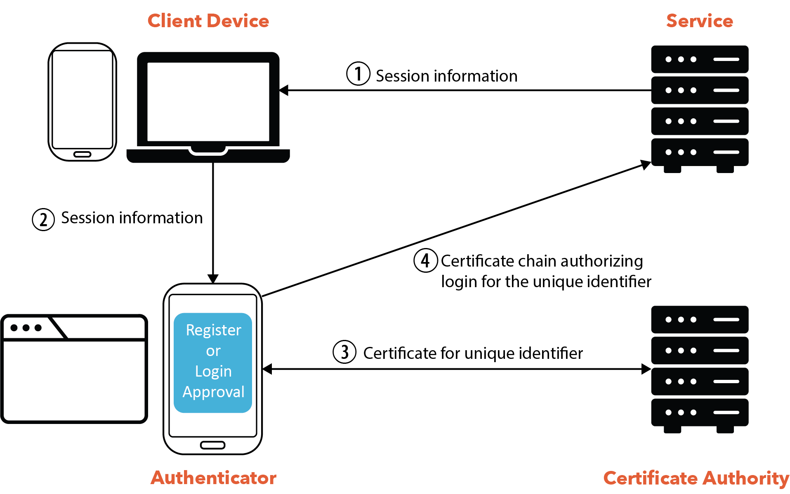

# Version 2

This document describes Version 2 of the Let's Authenticate System.

## Terminology

- authenticator: a device used to store certificates and authorize logins; we
  currently support three authenticators: a smartphone app, a browser extension,
  and a desktop app

- certificate authority: a system that issues certificates to an authenticator,
  certifying that the authenticator owns an opaque identifier formatted as
  `id@ca.org`.

- client device: a device where a user accesses a relying party, such as a
  laptop, desktop, or smartphone

- relying party: a website or other system that a user can authenticate with

## Overview

Let's Authenticate uses cryptographic identifiers for authentication with
relying parties. The following diagram illustrates the basic components:

1. A user wants to login to a relying party, such as website, through their
   client device, such as on a laptop. The relying party provides the client
   device with session information, which includes a session identifier.

1. The client device transfers this information to an authenticator. Depend- ing
   on the type of authenticator that the user wishes to use, the browser may
   complete this by using CTAP2 (browser to phone), app-to-app communication
   (mobile app to mobile app), scanning the DOM for hidden form fields (browser
   ex- tensions), or scanning a QR code (browser to phone).

1. The authenticator uses the recovery data to determine which account
   identifier it uses for that relying party. If it already has the a
   certificate proving ownership of this identifier, it can proceed to the next
   step. Otherwise, it obtains an account certificate proving ownership of its
   account identifier from the CA.

1. The authenticator creates a session certificate to authorize login to the
   relying party by the client device using the given session identifier. It
   provides both the account certificate and the session certificate to the
   relying party, which logs the user in.

## Certificates

There are three types of certificates used in Let's Authenticate:

- `authenticator certificate`: This is issued by the CA if the authenticator can
  prove knowledge of the user's password. This certificate allows the
  authenticator to obtain subsequent certificates for relying parties, without
  requiring the user to always re-enter their password.

- `account certificate`: This is issued by the CA if the authenticator can prove
  ownership of an authenticator certificate. The account certificate allows the
  authenticator to prove ownership of a random account identifier `id@ca.org`.
  The CA promises not to issue certificates for account identifiers except to
  the authorized owner of each identifier.

- `session certificate`: This is issued by the authenticator to authorize
  registration or login with a relying party. The authenticator provides both an
  `account certificate` and a `session certificate`, with the former providing
  ownership of a given account identifier and the latter authorizing login by a
  client device to the given account.

## Master Password

The user has a master password with the CA. Knowledge of the master password is
required to obtain, renew, or revoke an authenticator certificate. This ensures
that the user remains in control of which authenticators are authorized to
access their accounts, even if those authenticators are lost or stolen.
Knowledge of the master password is also required to decrypt recovery data.

## Roadmap

The documentation for Let's Authenticate is covered in the following:

- [Registration](./registration.md): Shows how a user registers with the
  certificate authority using an authenticator.

- [Login](./login.md): Shows how a user logs into the certificate authority
  using an authenticator. This is also used for authorizing a new or replacement
  authenticator.

- [Service Authentication](./serviceAuthentication.md): Shows how a user
  authenticates with a service using an authenticator.2

- [Authentication Data](./authenticationData.md): Shows how the authenticators
  store and synchronize authentication data with the certificate authority,
  which is used to associate account identifiers and keys with relying parties.
  Knowing the account identifier for a relying party allows the authenticator to
  ask the CA for a new account certificate for the relying party. Knowing the
  keys for a relying party allows the authenticator to authenticate with the
  relying party, since both a certificate (signed by the CA, attesting ownership
  of the account identifier) and the keys are needed for authentication.

- [Revocation](./revocation.md): TBD

- Account Recovery
- Logging out Remotely
