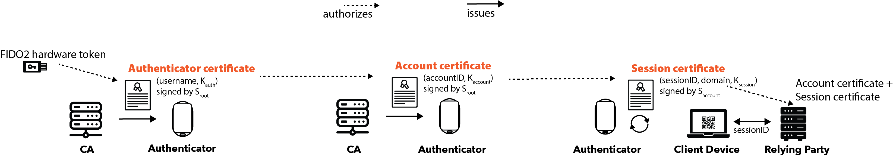

# Version 3

This document describes Version 3 of the Let's Authenticate System.

## Terminology

- authenticator: a device used to store certificates and authorize logins; we
  currently support three authenticators: a smartphone app, a browser extension,
  and a desktop app

- certificate authority: a system that issues certificates to an authenticator,
  certifying that the authenticator owns an opaque identifier formatted as
  `id@ca.org`.

- client device: a device where a user accesses a relying party, such as a
  laptop, desktop, or smartphone

- relying party: a website or other system that a user can authenticate with

## Overview

Let's Authenticate uses cryptographic keys and certificates for authentication
with relying parties. The following diagram provides an overview of how the
system works:

A Client is a device that can run a web browser, such as a laptop or smartphone.
An Authenticator obtains certificates and authenticates a user to a relying
party. An authenticator may be a mobile app on a smartphone, a browser
extension, or a desktop app. A Certificate Authority (CA) issues certificates to
a user’s authenticator. A Relying Party is a server that wants to authenticate
users, either for a website or a mobile application.

We use the notation (K,S) to refer to a key pair, where K is the public key and
S is the private key. The CA owns a key pair
(Kroot,Sroot).

There are three types of certificates used in Let's Authenticate:

- `authenticator certificate`: An authenticator certificate certifies that an
  authenticator is authorized to access a user’s account with the CA. To obtain
  an authenticator certificate, the authenticator creates a key pair,
  (Kauth , Sauth ). The user then accesses their account
  with the CA using a passwordless FIDO2 hardware token, and authorizes the
  creation of an authenticator certificate for Kauth. The
  authenticator certificate lists the username and authenticator public key,
  Kauth, and is signed by Sroot. Renewal of this
  certificate requires proving possession of the FIDO2 hardware token.

- `account certificate`: An account certificate enables an authenticator to
  prove ownership of an account with a relying party. The authenticator creates
  a key pair (Kaccount, Saccount) and generates a random
  accountID. It then uses the authenticator certificate to obtain an account
  certificate, which lists the account public key, Kaccount, and the
  accountID. The accountID is unique to a relying party (e.g., a website). This
  certificate is signed by Sroot. This certificate authorizes the
  authenticator to register or login to a relying party (RP).

- `session certificate`: A session certificate authorizes the login of a given
  session with an RP. Each time a client logs into an RP, the RP generates a
  unique session identifier for the client. The authenticator obtains this
  sessionID and creates a key pair (Ksession,Ssession).
  The authenticator then creates a session certificate that lists the sessionID,
  the domain name of the relying party, and Ksession. This
  certificate is signed by Saccount. The authenticator needs to
  present both an account certificate and a session certificate to login.

An important part of preventing unauthorized access is the system’s use of
Ksession. This is only accessible to the authenticator and is
encrypted when stored. This prevents a hacked CA from authorizing a login with
fake certificates because it does not have access to Ksession for the
account.

To protect a user against lost or stolen authenticators, a user can deauthorize
an authenticator at any time by proving possession of the FIDO2 hardware token.

## Roadmap

The documentation for Let's Authenticate is covered in the following:

- [Account Creation](./account-creation.md): Shows how a user creates an account
  with the certificate authority using an authenticator.

- [Login](./login.md): Shows how a user logs into the certificate authority
  using an authenticator. This is also used for authorizing a new or replacement
  authenticator.

- [Service Authentication](./serviceAuthentication.md): Shows how a user
  authenticates with a service using an authenticator.

- [Authentication Data](./authenticationData.md): Shows how the authenticators
  store and synchronize authentication data with the certificate authority,
  which is used to associate account identifiers and keys with relying parties.
  Knowing the account identifier for a relying party allows the authenticator to
  ask the CA for a new account certificate for the relying party. Knowing the
  keys for a relying party allows the authenticator to authenticate with the
  relying party, since both a certificate (signed by the CA, attesting ownership
  of the account identifier) and the keys are needed for authentication.

- [Revocation](./revocation.md): TBD

- Account Recovery
- Logging out Remotely
